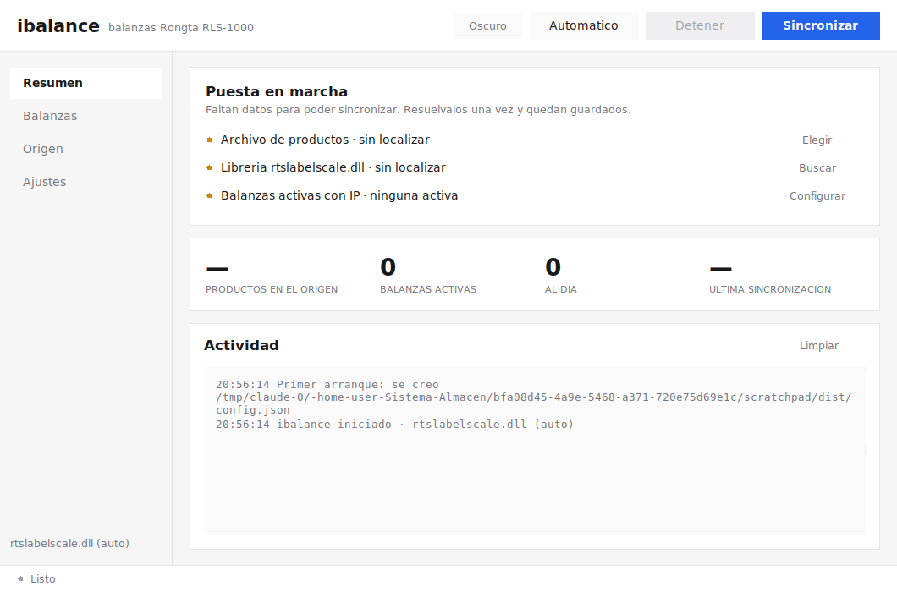
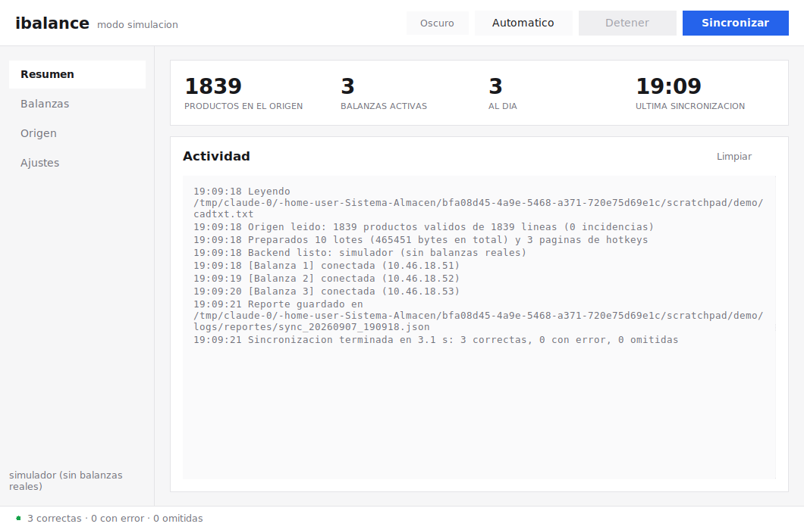
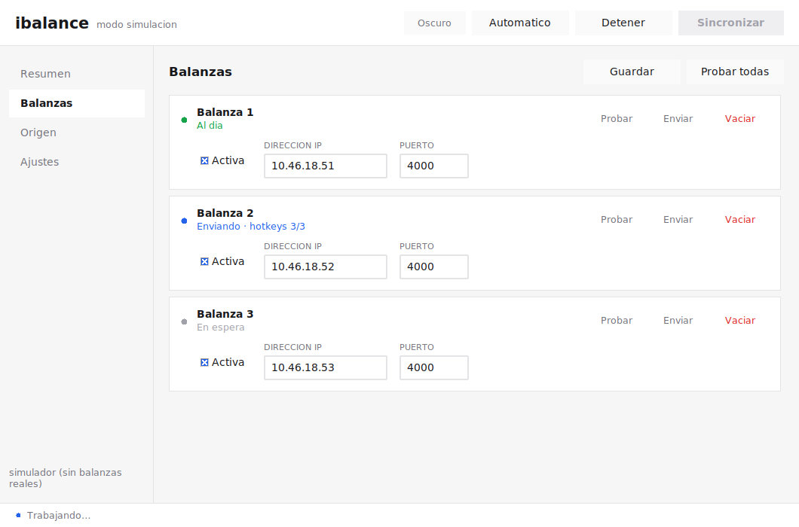
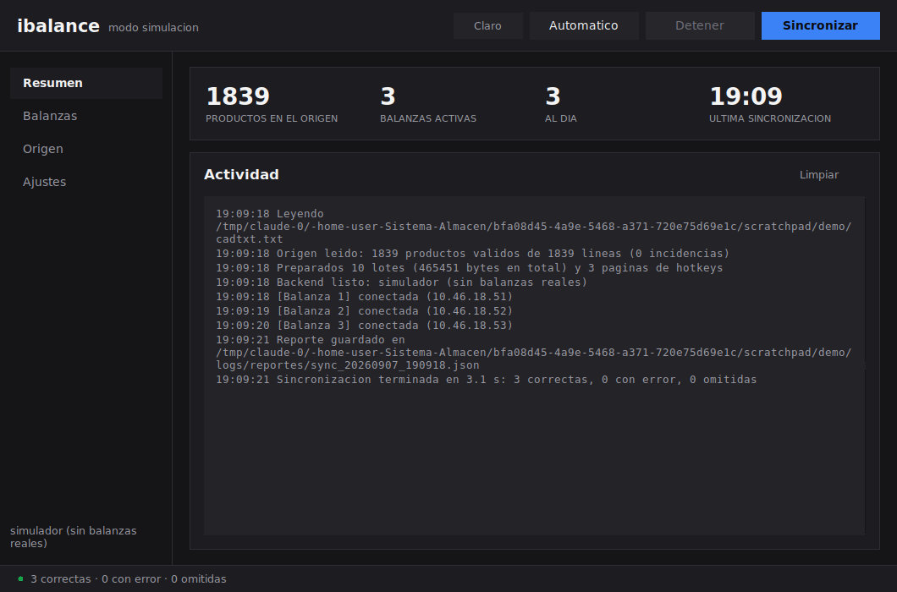

# ibalance — sincronización de balanzas Rongta RLS-1000/1100

Envía el catálogo de productos (PLU) del ERP a las balanzas etiquetadoras
Rongta de la tienda. La comunicación no se hace por sockets propios: se delega
en la librería nativa del fabricante **`rtslabelscale.dll`** (32 bits) a través
de `ctypes`.

Las RLS-1000 aceptan **una sola conexión TCP simultánea**, así que la
aplicación conecta, envía y desconecta de inmediato para liberar el puerto.

```
cadtxt.txt  ──►  lector  ──►  JSON de PLU  ──►  rtslabelscale.dll  ──►  balanza
(ancho fijo)               + tablas de hotkeys        (ctypes)          (TCP)
```

## Estado

Funcional y probado de extremo a extremo con el archivo real de producción
(1.839 productos, 6 balanzas) usando el backend simulado. **Falta la prueba
contra balanzas físicas**, que solo puede hacerse en la tienda con Python de
32 bits en Windows.

## Requisitos

- **Windows.** Si usa el `.exe` de Releases, nada más: lleva Python dentro.
  Para trabajar desde el código hace falta **Python 3.10 o superior de 32
  bits**, porque la DLL es de 32 bits (ver
  [`docs/DESPLIEGUE_WINDOWS.md`](docs/DESPLIEGUE_WINDOWS.md)).
- `rtslabelscale.dll` y su carpeta `RLS1000\`, tal como los entrega el
  fabricante.
- Sin dependencias de terceros: solo biblioteca estándar, lo que simplifica el
  empaquetado en 32 bits.

Para desarrollar y probar el parseo y los payloads sirve cualquier sistema
operativo, gracias al backend simulado.

## Instalación en la tienda

Descargue `ibalance2-windows-x86.zip` de la pestaña
[Releases](../../releases), descomprímalo en `C:\ibalance` y haga **doble clic
en `ibalance2.exe`**. No hay que instalar Python ni editar archivos.

La primera vez, la aplicación crea su `config.json`, busca sola la
`rtslabelscale.dll` y muestra en pantalla lo que falta:



Resuelva los tres puntos y la lista desaparece. Detalle en
[`tools/LEEME.txt`](tools/LEEME.txt).

El zip trae dos ejecutables:

| Archivo | Para qué |
|---|---|
| `ibalance2.exe` | la aplicación con ventana; es la del doble clic |
| `ibalance2-consola.exe` | la misma, en consola: diagnóstico y tareas programadas |

Son dos porque un ejecutable de ventana no tiene salida de texto: `check` y
`sync` no podrían mostrar nada.

Opcionalmente, `instalar.ps1` deja la carpeta en su sitio, crea el acceso
directo y programa la sincronización automática:

```powershell
.\instalar.ps1 -CrearTarea -Intervalo 60
```

## Instalación desde el código

```bash
pip install -e .
ibalance init                    # crea config.json
ibalance check                   # valida config, origen, DLL y red
ibalance sync --simular          # ensayo sin tocar las balanzas
ibalance sync                    # envío real
ibalance                         # sin argumentos abre la ventana
```

## Comandos

| Comando | Para qué |
|---|---|
| `ibalance init` | crea un `config.json` de ejemplo |
| `ibalance check` | valida configuración, archivo de origen, arquitectura y exportaciones de la DLL, ping y puerto de cada balanza |
| `ibalance preview [--json]` | muestra los productos leídos y el payload exacto, sin tocar la red |
| `ibalance sync [-b ID] [--forzar] [--simular]` | sincroniza; devuelve `0` si todo fue bien |
| `ibalance clear -b ID` | borra el catálogo de una balanza (`rtscaleClearPLUData`) |
| `ibalance daemon [--intervalo N]` | sincroniza cada N minutos |
| `ibalance dll [ruta]` | diagnóstico de la DLL: arquitectura y exportaciones |
| `ibalance gui` | interfaz gráfica |

## Interfaz gráfica



Cuatro vistas en una barra lateral:

| Vista | Qué hace |
|---|---|
| **Resumen** | métricas de la corrida y registro de actividad en vivo |
| **Balanzas** | una tarjeta por balanza: estado en vivo, IP y puerto, *Probar*, *Enviar* y *Vaciar* |
| **Origen** | ruta del archivo y vista previa de los productos leídos, con sus incidencias |
| **Ajustes** | librería, intervalos, reintentos y tamaño de lote |

Cada balanza muestra su estado según avanza el envío, y la barra inferior
resume la corrida:



Hay tema claro y oscuro (botón de la esquina superior derecha):



Por dentro: la sincronización corre en un hilo aparte y todo lo que vuelve de
él —líneas de log, cambios de estado, el resultado final— pasa por una cola que
vacía el hilo de la interfaz, porque tkinter solo puede tocarse desde el hilo
que creó la ventana. Los colores viven en `gui/tema.py` y las piezas visuales
en `gui/widgets.py`, así que cambiar el aspecto no obliga a tocar la ventana.

## Configuración

`config.json` junto al ejecutable. Copia comentada en
[`config.example.json`](config.example.json). Lo mínimo:

```json
{
  "origen": { "ruta": "X:\\cadtxt.txt" },
  "rongta": { "dll_path": "C:\\ibalance\\rtslabelscale.dll" },
  "balanzas": [
    { "id": 1, "ip": "10.46.18.50", "activa": true }
  ]
}
```

Un `config.json` de la versión anterior se migra solo al abrirlo.

Ajustes que conviene conocer:

| Clave | Por defecto | Para qué |
|---|---|---|
| `rongta.tamano_lote_plu` | `200` | productos por llamada a la DLL; `0` los manda todos juntos |
| `rongta.convencion_llamada` | `"stdcall"` | `"auto"` la detecta sola si cambiara la DLL |
| `rongta.formato_legacy` | `false` | reproduce la cadena JSON exacta de la app antigua |
| `rongta.hotkeys.codigos` | `[]` | lista fija de códigos para las 84 teclas rápidas |
| `sincronizacion.balanzas_en_paralelo` | `1` | una balanza cada vez; súbalo solo si lo probó |
| `sincronizacion.omitir_si_sin_cambios` | `false` | salta las balanzas ya al día (huella por balanza) |
| `sincronizacion.cerrar_procesos_legacy` | `false` | cierra la app antigua que retiene el puerto |
| `origen.layout` | posiciones del `cadtxt.txt` | permite otro ancho de campos sin tocar código |

## Formato de origen

`cadtxt.txt` de ancho fijo (79 caracteres, latin-1). También lee CSV.
Detalle completo en [`docs/FORMATO_CADTXT.md`](docs/FORMATO_CADTXT.md).

```
002893P**PITAHAYA ROJA X KG**0000750000                       2 1 1
código │ nombre               precio  vida útil
```

## Documentación

- [`docs/INSTALACION.md`](docs/INSTALACION.md) — instrucciones completas para
  quien instale en la tienda, autocontenidas.
- [`docs/DLL_RTSLABELSCALE.md`](docs/DLL_RTSLABELSCALE.md) — firmas, formato
  del JSON y ciclo de sesión de la DLL, con la evidencia de dónde salió cada
  dato.
- [`docs/FORMATO_CADTXT.md`](docs/FORMATO_CADTXT.md) — el archivo de origen.
- [`docs/DESPLIEGUE_WINDOWS.md`](docs/DESPLIEGUE_WINDOWS.md) — instalación,
  32 bits, tarea programada y diagnóstico.
- [`docs/DIFERENCIAS.md`](docs/DIFERENCIAS.md) — qué cambia respecto a las
  versiones anteriores y qué fallos concretos corrige.

## Desarrollo

```bash
pip install -e ".[dev]"
pytest -q                                   # 54 pruebas
ruff check src tests tools
python tools/inspect_dll.py ruta/a/rtslabelscale.dll
```

Las pruebas usan `BackendSimulado`, que reproduce la restricción de una sola
conexión por balanza y rechaza los lotes cuyo `ipack` no coincide con el
contenido, igual que el equipo real. Por eso corren en cualquier sistema
operativo y detectan las fugas de conexión.

## Estructura

```
src/ibalance/
    config.py          configuración, validación y migración
    models.py          Plu y resultados
    engine.py          motor: lee, trocea, envía, reintenta
    scheduler.py       temporizador
    net.py             ping y sondeo TCP
    procesos.py        cierre de la aplicación antigua
    report.py          reportes por corrida y estado por balanza
    cli.py             línea de comandos
    sources/           lectores (ancho fijo, CSV)
    rongta/            payload, envoltorio ctypes de la DLL, simulador
    gui/               interfaz tkinter (tema.py, widgets.py, app.py)
tools/
    entrada.py         punto de entrada de PyInstaller
    build_exe.ps1      compilación local con PyInstaller de 32 bits
    instalar.ps1       instalador para el equipo de la tienda
    inspect_dll.py     inspección de la DLL sin cargarla
    LEEME.txt          guía que acompaña al ejecutable
```
